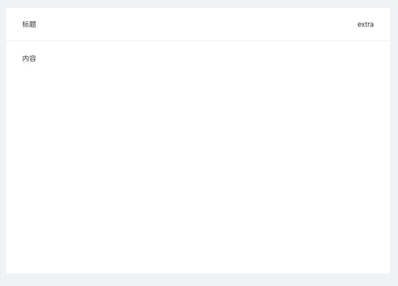

#  

# layoutContainer

组件 : `@/components/general/layout/layoutContainer.vue`


``` js
//引用
import LayoutContainer from "lxView.js"

export default {
    components:{
        // 组件声明
        layoutContainer
    },
}
```

``` html
<layout-container class="commdoityDiv flex">
        <div slot="title">标题</div>
        <div slot="extra">extra</div>
        <div slot="body">内容</div>
</layout-container>
```

layoutContainer slot： 

| 名称 | 说明 | 
| ------ | ------ |
| title | 标题位置 |
| extra | 小标题（标题右侧内容）|
| body | 内容 |


效果图一：
