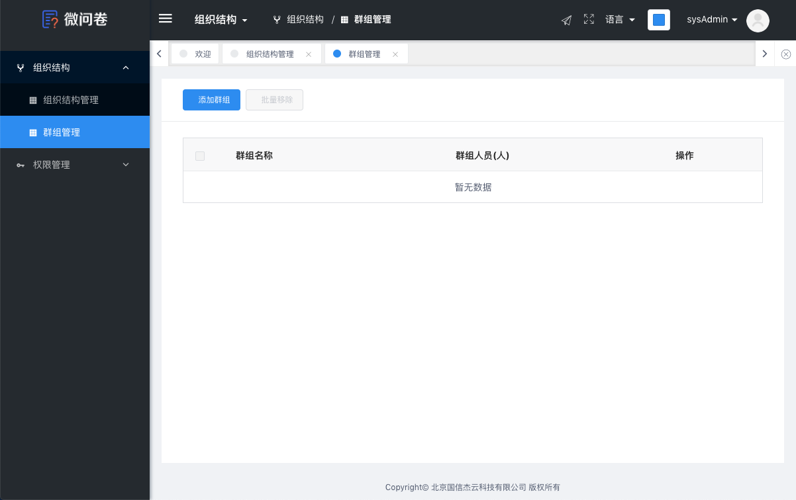

#  
# 框架模板
此框架提供多种布局模板，分别为 `src/template` 下的 `template1` 和 `template2`以及其他 ， 示例图片如下: 

此模板提供四大模块，分别人顶部`功能模块`、`菜单功能模块`、`内容展示模块`和`底部版权模块`。

#### 顶部功能模块 
- logo
- 收缩侧边栏
- 项目模块切换
- 动态面包屑
- 引导功能
<!-- - 国际化多语言（包括 中文简体，中文繁休和英文） -->
- 多种动态换肤
- 个人信息 （展示当前登录人的账号，可退出和修改密码）

#### 菜单功能模块
- 动态侧边栏（支持多级路由嵌套）

#### 内容展示模块
- 快捷导航(标签页)
- 内容展示

# 框架模板一

框架模板一路径`apps/start/page/template1`

```html
<Layout style="height: 100%" class="main">
    <Layout>
        <!-- 顶部功能模块 -->
        <Header class="header-con ivu-layout-sider" style="padding-left:0px;">
            <header-bar>
                <logo-con slot="logo"></logo-con>
                <user/>
                <theme-picker></theme-picker>
                <language style="margin-right:15px;"/>
                <fullscreen style="margin-right:15px;"/>
                <Guide style="margin-right: 15px;"></Guide>
            </header-bar> 
        </Header>
        <Content class="main-content-con flex-1">
        <div class="flex main-content-wrap">
            <!-- 菜单功能模块 -->
            <sider-wrap></sider-wrap>
            <Layout class="main-layout-con">
                <!-- 内容展示模块 -->
                <div class="tag-nav-wrapper">
                    <tags-nav/> 
                </div>
                <Content class="content-wrapper">
                    <keep-alive>
                        <router-view v-if="$route.meta.keepAlive"></router-view>
                        <router-view v-if="!$route.meta.keepAlive"></router-view>
                    </keep-alive>
                </Content>
                <!-- 底部版权模块 -->
                <footer-wrap></footer-wrap>
            </Layout>
        </div>
        </Content>
    </Layout>
</Layout>
```


# 图片展示（模板一）
效果图一：


效果图二（菜单收缩）


# 框架模板二
框架模板一路径`apps/start/page/template2`
```html
<Layout style="height: 100%" class="main">
    <Layout>
        <Header class="header-con ivu-layout-sider" style="padding-left:0px;">
            <header-bar>
                <user />
                <theme-picker></theme-picker>
                <language style="margin-right: 15px;"/>
                <fullscreen style="margin-right: 15px;"/>
                <Guide style="margin-right: 15px;"></Guide>
            </header-bar>
        </Header>
        <Content class="main-content-con flex-1">
        <div class="flex main-content-wrap">
            <Layout class="main-layout-con">
                <Content class="content-wrapper" >
                    <keep-alive>
                        <router-view v-if="$route.meta.keepAlive"></router-view>
                        <router-view v-if="!$route.meta.keepAlive"></router-view>
                    </keep-alive>
                </Content>
                <footer-wrap></footer-wrap>
            </Layout>
        </div> 
        </Content>
    </Layout>
</Layout>
```

# 图片展示（模板二）


# 框架模板三 
框架模板一路径`apps/start/page/template3`

!> 与模板二html相同，但css不一致

```html
<Layout style="height: 100%" class="main">
    <Layout>
        <Header class="header-con ivu-layout-sider" style="padding-left:0px;">
            <header-bar>
                <user />
                <theme-picker></theme-picker>
                <language style="margin-right: 15px;"/>
                <fullscreen style="margin-right: 15px;"/>
                <Guide style="margin-right: 15px;"></Guide>
            </header-bar>
        </Header>
        <Content class="main-content-con flex-1">
        <div class="flex main-content-wrap">
            <Layout class="main-layout-con">
                <Content class="content-wrapper" >
                    <keep-alive>
                        <router-view v-if="$route.meta.keepAlive"></router-view>
                        <router-view v-if="!$route.meta.keepAlive"></router-view>
                    </keep-alive>
                </Content>
                <footer-wrap></footer-wrap>
            </Layout>
        </div> 
        </Content>
    </Layout>
</Layout>
```

# 图片展示（模板三）


