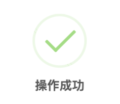
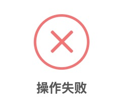
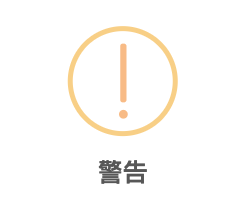

# 提示插件

# 安装

组件地址： `https://github.com/xtaymydmyd/lxComponents` 中 alert文件夹, 下载后加入到项目中；


# 配置项 

- npm 安装

``` 
npm install vux@2.7.5
``` 

# 代码示例 - success
``` html
<!-- 打开提示，提示状态为成功 -->
<alertSuccess 
    v-model="success" 
    :text="text" 
    :hideOnBlur="hideOnBlur" 
    @on-hide="success = false"></alertSuccess>

<button @click="changeSuccess">打开success</button>

``` 
``` js
<script>
import alertSuccess from 'demo/components/alert/alert-success.vue'
export default {
    name: 'app',
    data() {
        return {
            timeout : 2,
            success : false,
            text : '操作成功',
            hideOnBlur : true,
        }
    },
    components: {
        alertSuccess,
    },
    methods: {
        changeSuccess(){
            this.success = true;
        },
    },
}
</script>
``` 

### 效果图一：


# 代码示例 - error

``` html
<!-- 打开提示，提示状态为失败/出错 -->
<alertError
    v-model="error"
    :text="errorText"
    :hideOnBlur="hideOnBlur" 
    @on-hide="error = false"></alertError>

<button @click="changeError">打开error</button>

``` 
``` js
<script>
import alertError from 'demo/components/alert/alert-error.vue'
export default {
    name: 'app',
    data() {
        return {
            timeout : 2,
            hideOnBlur : true,
            error : false,
            errorText : '操作失败',
        }
    },
    components: {
        alertError,
    },
    methods: {
        changeError(){
            this.error = true;
        },
    },
}
</script>
``` 
### 效果图一：



# 代码示例 - warning

``` html
<!-- 打开提示，提示状态为警告 -->
<alertWarning 
    v-model="warning"
    :text="warningText"
    :hideOnBlur="hideOnBlur" 
    @on-hide="warning = false"></alertWarning>

<button @click="changeWarning">打开warning</button>
``` 
``` js
<script>
import alertWarning from 'demo/components/alert/alert-warning.vue'
export default {
    name: 'app',
    data() {
        return {
            timeout : 2,
            hideOnBlur : true,
            warning : false,
            warningText : "警告"
        }
    },
    components: {
        alertWarning
    },
    methods: {
        changeWarning(){
            this.warning = true;
        }
    },
}
</script>
``` 
### 效果图一：


# API

| 属性 | 说明 | 类型 | 默认值 |
| ------ | ------ | ------ | ------ |
| value | 提示是否可见，使用`v-model`绑定 | Boolean | false |
| text | 提示文字 | String | 相关对应文字为：‘操作成功’ 、‘操作失败’、‘警告’ |
| hideOnBlur | 是否点击遮罩时自动关闭弹窗 | Boolean | false |
| timeout | 延迟自动关闭提示 | Number | 0 |

# Events

| 事件名 | 说明 | 返回值 |
| ------ | ------ | ------ |
| on-hide | 提示关闭 |  |

