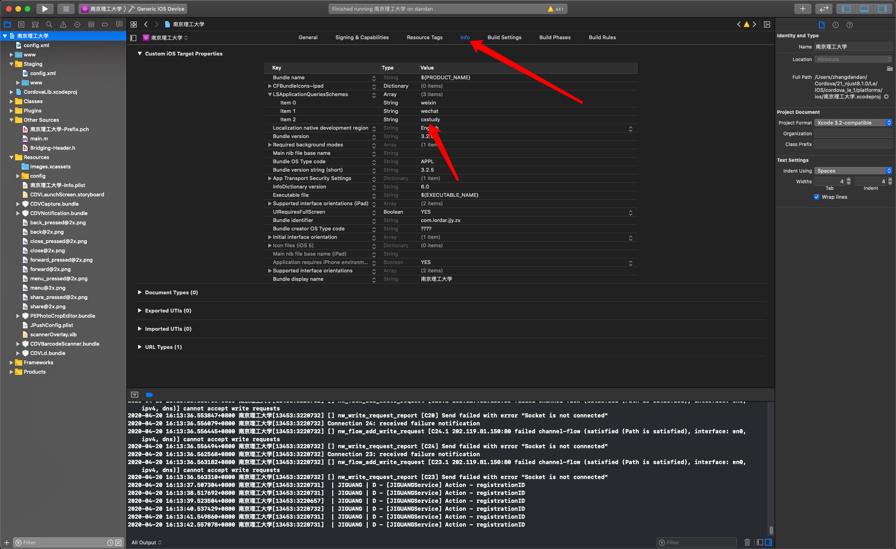

# 南理工APP唤起第三方APP（超星）

示例：

说明明文档：`https://document.chaoxing.com/web/#/1?page_id=8`

协议名称：`cxstudy://`

scheme:cxstudy
学习通下载地址：`https://apps.chaoxing.com/`

Android学习通包名：`com.chaoxing.mobile`

ios学习通appStore地址：`https://itunes.apple.com/cn/app/%E8%B6%85%E6%98%9F%E5%AD%A6%E4%B9%A0%E9%80%9A/id977946724?mt=8`


## 判断是否安装第三方APP

1、插件准备

``` cordova
cordova plugin add cordova-plugin-appavailability --save
```

2、config.xml设置
``` Android
 <access launch-external="yes" origin="cxstudy:*" />
```

``` IOS
 <access launch-external="yes" origin="cxstudy:*" />
 <allow-navigation href="cxstudy://*/*" />
```

3、xcode设置
增加 一条 item  : cxstudy



4、前端代码
``` js
bridgeMethod(){
    var self = this;
    if (constGlobal.isAndroid()) {
        appAvailability.check('com.chaoxing.mobile', function () {
                location.href = 'cxstudy://cxstudy/login?fid=xxx&fidType=xxx&token=xxx'
            },
            function () {
                common.toastMsg("尚未安装学习通！");
            }
        );
    }
    if (constGlobal.isIOS()) {
        appAvailability.check('cxstudy://', function () {
                location.href = "cxstudy://cxstudy/login?fid=xxx&fidType=xxx&token=xxx"
            },
            function () {
                common.toastMsg("尚未安装学习通！");
            }
        );
    }
}
```

