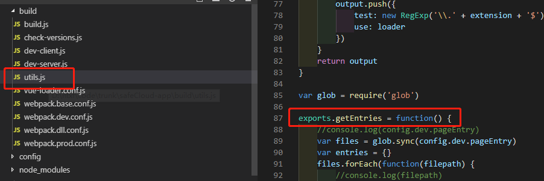
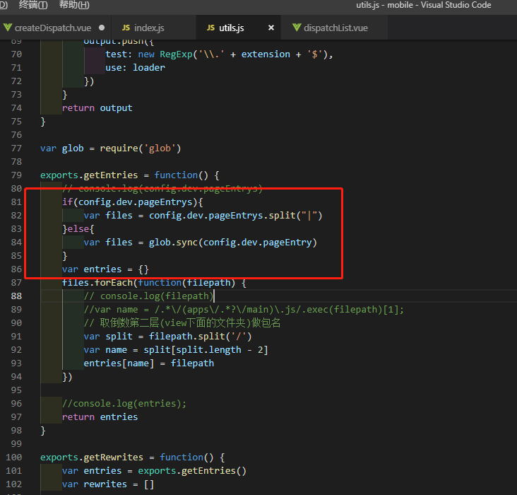
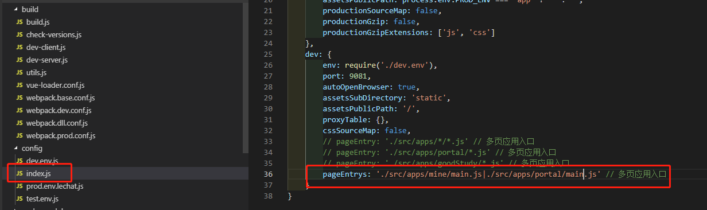
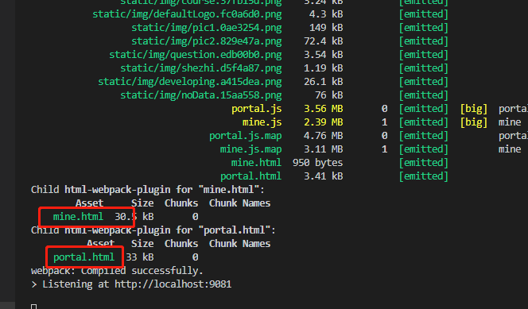

# 启动任意多个项目配置

1、修改/build/utils.js里的getEntries方法，如图：



``` 部分代码

...
    if(config.dev.pageEntrys){
        var files = config.dev.pageEntrys.split("|")
    }else{
        var files = glob.sync(config.dev.pageEntry)
    }
...

```
2、将上述代码覆盖到如图位置：



3、修改/config/index.js，如下图：



添加pageEntrys变量，将想启动项目用”|”分隔写在后面，再运行NPM RUN DEV，你将会看到只启动了你配置的项目。

运行结果如下图：

