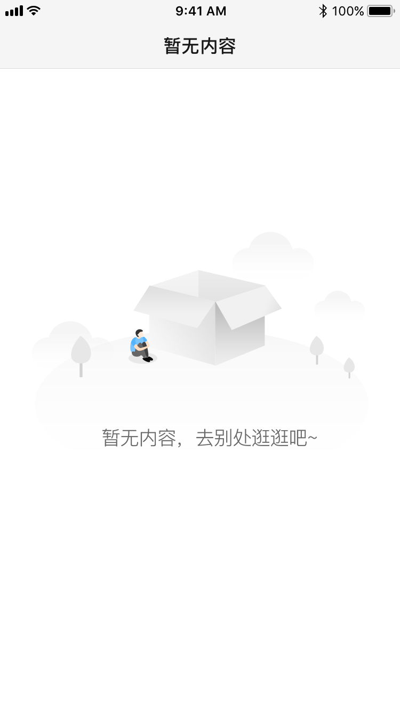
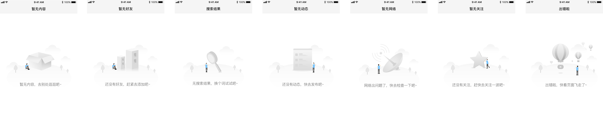

# 缺省页面


## 安装

组件地址： `https://github.com/xtaymydmyd/lxComponents/` 中 `defaultTip` 文件夹, 下载后加入到项目中,建议组件位置置于 `src/components`中；


## 组件注为全局组件

在项目中 `config.js` 或  项目中`main.js` 引入缺省页，作为全局组件

```js
import defaultTip from 'components/defaultTip'
Vue.use(defaultTip)
```

## 代码示例 

### content

类型为 `content`,示例如下
```html
<default-tip 
    :value="show"
    text="暂无内容"
    :type="content"> 
</default-tip> 
```
### 效果图：




### 其他效果图



# API

| 属性 | 说明 | 类型 | 默认值 |
| ------ | ------ | ------ | ------ |
| value | 提示是否可见 | Boolean | false |
| text | 提示文字 | String | 如无内容，则根据下述 `type`来显示不同的内容 |
| type | 根据`type`显示不同的图片 | String | 'content' ，|


## TYPE

| 属性 | 说明 |
| ------ | ------ |
| content | 暂无内容，去别处逛逛吧〜 | 
| dynamic | 还没有动态，快去发布吧〜 | 
| error | 出错啦，快看页面飞走啦〜 | 
| friend | 还没有好友，赶紧去添加吧〜 | 
| network | 网络出问题了，快去检查一下吧〜 | 
| search | 无搜索结果，换个词试试吧〜 |  
| star | 还没有关注，赶快人去关注一波吧〜 | 

## slot插槽
| 名字 | 说明 |  
| ------ | ------ |
| content | 关注提示文字下方 | 