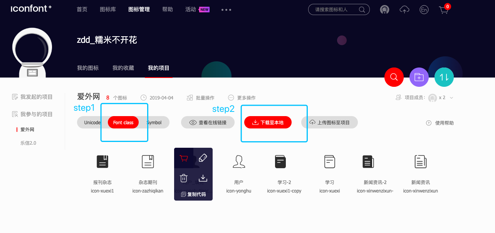
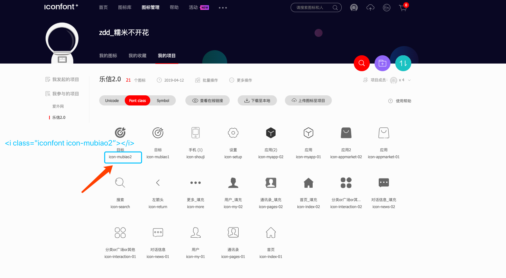

#  

# iconFont矢量图标使用说明

# 发布平台

阿里巴巴矢量图标库 ： `https://www.iconfont.cn/`

!> 登录成功后，可在 `图标管理` > `我的项目` 中查看图标，如果`我参与的项目`没有项目列表，请联系ui组同事将你加入到项目中

选择 `Font class` 标签 ，点击 `下载到本地` 



得到以下目录的文件 :

```text
    -| demo_index.html
    -| demo.css
    -| iconfont.css
    -| iconfont.eot
    -| iconfont.eot
    -| iconfont.js
    -| iconfont.svg
    -| iconfont.ttf
    -| iconfont.woff
    -| iconfont.woff2
```
# 使用方式

将上述下载并解压文件拷贝到 `static/font/`目录下；

!> 请在 build - webpack.base.conf.js 中配置 
```js
resolve: {
    modules: [
        resolve('static')
    ]
}
```

引用方式 ： 在 App.vue 或 public.scss 中加入以下代码：

```css
<style lang="css">
    @import '~font/iconfont.css';
</style>
```

使用方式： 
```html
<i class="icon iconfont icon-xxx"></i>
```
!> icon-xxx 是图标名称

示例如下：



