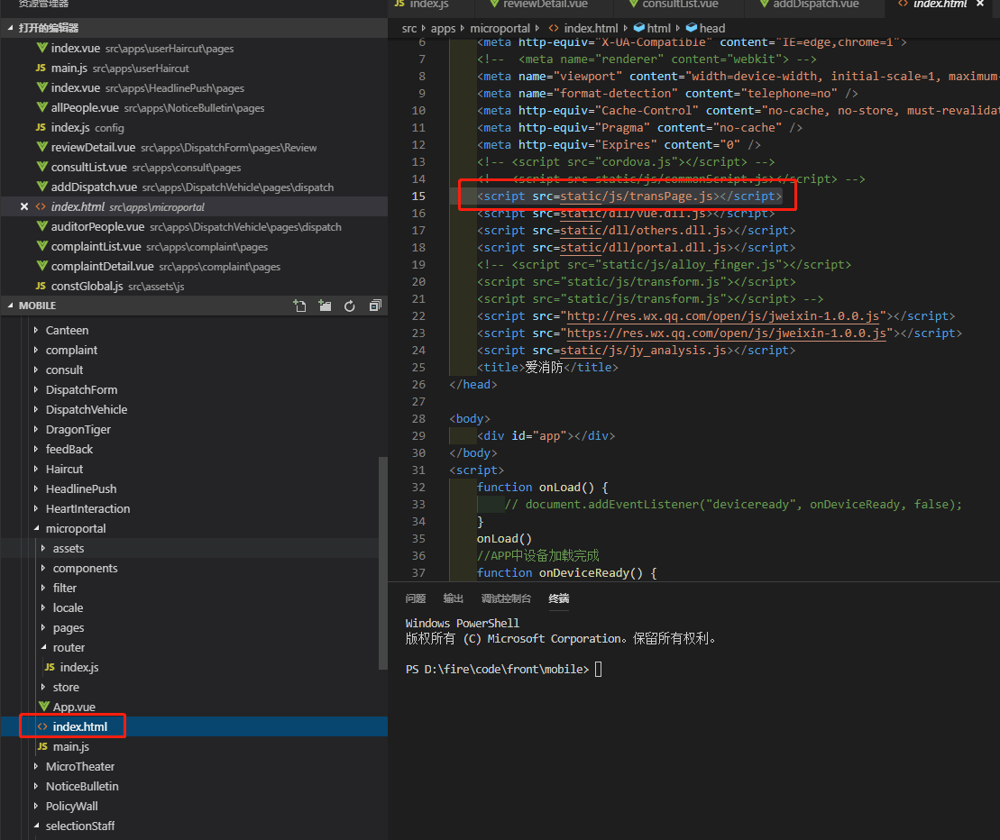

# 外链跳转中转

访问链接：
```demo
http://xfapp.jieyundata.com/fire/microportal.html?module=moduleName&route=level1%2flevel2&param1=value1&param2=value2
```

在`index.art`中引入 `resource/transPage.js`,代码如下： 
```js
/*
 * @Description: 通过在页面加载前，判断是否有需要跳转到具体的模块及路由，有则跳转到指定页面，目的是用户按返回时，能回到首页而不是退出
 * @Author: Cloud
 * @Date: 2018-10-31 10:01:30
 * @LastEditors: Cloud
 * @LastEditTime: 2019-05-17 15:52:06
 */
// window.onload = winOnload;
winOnload();
function winOnload(){
    var params = GetRequest();
    // 只做一次跳转，防止回退时反复跳转
    var isJumped = sessionStorage.getItem("isJumped");
    // isJumped = false;
    // debugger
    if(!isJumped && params && params.module){
        sessionStorage.setItem("isJumped", "true");
        var module = params['module']
        var route = params['route']
        var otherParam = '';
        for(var temp in params){
            if(temp!='module' && temp !='route'){
                otherParam += "&" + temp + '=' + params[temp]
            }
        }
        var url = module + ".html#/" + route + '?' +  otherParam; 
        // history.pushState({name:'首页'}, "",  "microportal.html")
        // history.pushState({name:'业务'}, "",  url)
        // window.location.reload();
        // debugger
        // window.location.href = url; 
        history.pushState(null,null,'microportal.html')
        window.location.assign(url);
    }
}
// 获取url参数，并组织成对象
function GetRequest() {   
    var url = location.search; //获取url中"?"符后的字串   
    var theRequest = new Object();   
    if (url.indexOf("?") != -1) {   
        var str = url.substr(1);   
        strs = str.split("&");   
        for(var i = 0; i < strs.length; i ++) {   
            theRequest[strs[i].split("=")[0]]=unescape(strs[i].split("=")[1]);   
        }   
    }   
    return theRequest;   
}   
```

在 `index.art`引入文件，例如：
