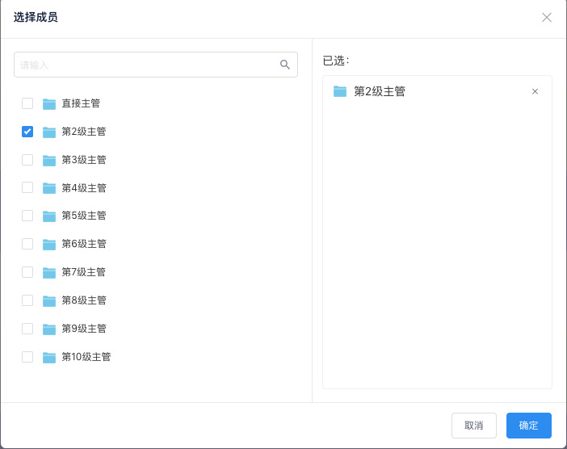

#  
# 流程引擎选人功能

组件地址 : `https://github.com/xtaymydmyd/lxComponents` ， 可下载后加入到项目中；

# 配置项

安装插件
``` js
//安装
npm install mint-ui@2.2.9
``` 

你可以配置在`main.js` , 

``` js
/** 滚动分页***/
import 'mint-ui/lib/style.css'
import Mint from 'mint-ui'
Vue.use(Mint)
import { InfiniteScroll } from 'mint-ui'
Vue.use(InfiniteScroll)
```

devConstGlobal.js中配置请求前缀
``` js
HostPrivilege: 'http://192.168.3.9:9911/privilege/',
HostContact: 'http://192.168.3.9:9912/orgContacts/',
``` 

constGlobal.js中配置请求前缀
``` js
// 组织结构
HostContact: mainHost + '/orgContacts/',
// 权限
HostPrivilege: mainHost + '/privilege/',
``` 


## 模式一 —— 功能 （单选及多选）
- 选择人员
- 选择部门
- 选择角色、群组、岗位
- 主管

``` html
<select-component ref="selectComponent" @on-submit="submit" @on-cancel="cancel"></select-component>

<button @click="openSelect">全部</button>
```

``` js

import selectComponent from 'lechatComponent/components/selector/select.vue'

export default {
    name: 'index',
    components:{
        selectComponent,
    },
    mounted() {
        this.$refs.selectComponent.open(config);
    },
    methods: {
        openSelect(){
            var config = {
                model : 1,
                deptList : ['0af424d6dcb511e8a3b10242ac110008'],
                condition : ['org', 'role','charge','group' , 'post']
                type : 2, // 1 ：默认 ,选人、选部门、角色列表、主管（配合condition） ； 2 : 只选人
                chargeLevel : 10,
                title : '选择成员',
                muliteChoice : 2 ,//1 : 多选 2 : 单选
                require : 1,
                data : [
                    {
                        "label": "第2级主管",
                        "id": "charge1",
                        "type": 6
                    },
                    {
                        "label": "销售部",
                        "id": "0568d964858f4a2ebbf3767f2c356503",
                        "type": 1
                    }
                ]
            }
            this.$refs.selectComponent.open(config);
        },
        submit(result){
            console.log(result)
        },
        cancel(result){
            console.log(result)
        }
    },
}

```

## 模式二 —— 功能 （单选及多选）

- 选择人员 （在指定角色中）

``` html
<select-component ref="selectComponent" @on-submit="submit" @on-cancel="cancel"></select-component>

<button @click="openSelect">全部</button>
```

``` js

import selectComponent from 'lechatComponent/components/selector/select.vue'

export default {
    name: 'index',
    components:{
        selectComponent,
    },
    mounted() {
        this.$refs.selectComponent.open(config);
    },
    methods: {
        openSelect(){
            var config = {
                model : 2,
                roleList : ['8d092ae3629a41b0a3e9aa0a6b831053'],
                title : '在某角色下选择人员',
                muliteChoice : 2 ,//1 : 多选 2 : 单选
                require : 1,
                data : [
                    {
                        "label": "第2级主管",
                        "id": "charge1",
                        "type": 6
                    }
                ]
            }
            this.$refs.selectComponent.open(config);
        },
        submit(result){
            console.log(result)
        },
        cancel(result){
            console.log(result)
        }
    },
}

```

# API

| 属性 | 说明 | 类型 | 默认值 |
| ------ | ------ | ------ | ------ |
| <font color="red">model</font> | <font color="red">模式选择</font>  | Number | 默认值为 1 ， 分别有 1 和 2 |
| title | 弹出框标题 | String | '选择成员' |
| deptList | 根节点id , model = 1时，deptList必填 | Array | 必填,例如：['1','2'] |
| roleList | 角色id , model = 2时，roleList必填 | Array | 必填,例如：['role1','role2'] |
| condition | 表示插件提供‘组织结构’（'org'）、‘角色’(role)、‘主管’(charge)、‘群组’(group)、‘post’(岗位) | Array | 必填 : [ 'org' , 'role' , 'charge'，'group'，'post'] |
| type | 1: 选择人、部门、角色、岗位、群组及主管，配合condition使用 ； 2 ：表示选人 ; 3 : 表示选择人及群组及群组下的人| Number | 1 |
| chargeLevel | 主管等级 | Number | 10 |
| muliteChoice | 1 : 多选 2 : 单选 | Number | 1(多选) |
| require | 数据是否必选 | Number | 默认值 1 ， 1 ：不必选 ； 2 ： 必选 |
| data | 默认已选人员 | Array | [] |


# Events

| 事件名 | 说明 | 返回值 |
| ------ | ------ | ------ |
| on-submit | 选择成功后触发 | Array |
| on-cancel | 取消选择后触发 | [] |
| on-delete | 删除一条数据后触发 | Object |


# 返回值说明 


| key | value说明 | 
| ------ | ------ |
| label | 名称 |
| id | 返回数据id |
| type | 返回数据类型 |


说明：

| 值 | 说明 |
| ------ | ------ |
| 0 | 部门 |
| 1 | 人员 |
| 4 | 角色 |
| 3 | 群组 |
| 2 | 岗位 |
| 5 | 主管 |


# 效果图

### 效果图一：
``` js
    var config = {
        deptList : ['ee8efbe2bfbb437d9a8da1f6d12bdcfc'],
        condition : ['role'],
        type : 1, // 1 ：默认 ,选人、选部门、角色列表、主管（配合condition） ； 2 : 只选人
        chargeLevel : 10,
        title : '选择成员',
        muliteChoice : 2 ,//1 : 多选 2 : 单选
        data : []
    }
```


### 效果图二： 
``` js
    var config = {
        deptList : ['ee8efbe2bfbb437d9a8da1f6d12bdcfc'],
        condition : ['role'],
        type : 2, 
        chargeLevel : 10,
        title : '选择成员',
        muliteChoice : 2 ,
        data : []
    }
```


### 效果图三： 
``` js
    var config = {
        deptList : ['ee8efbe2bfbb437d9a8da1f6d12bdcfc'],
        condition : ['group'],
        type : 2, 
        chargeLevel : 10,
        title : '选择成员',
        muliteChoice : 2 ,
        data : []
    }
```


### 效果图四： 
``` js
    var config = {
        deptList : ['ee8efbe2bfbb437d9a8da1f6d12bdcfc'],
        condition : ['charge'],
        type : 2, 
        chargeLevel : 10,
        title : '选择成员',
        muliteChoice : 2 ,
        data : []
    }
```



### 效果图五： 
``` js
    var config = {
        deptList : ['ee8efbe2bfbb437d9a8da1f6d12bdcfc'],
        condition : ['org','role','charge'],
        type : 2, 
        chargeLevel : 10,
        title : '选择成员',
        muliteChoice : 2 ,
        data : []
    }
```
