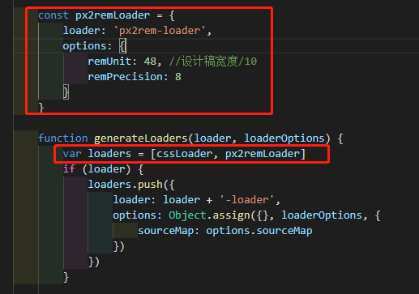

# 手机端REM布局

!> 参考: https://juejin.im/post/5afba3c5f265da0b9e653b6c

## `Vue-cli`配合`lib-flexible` 实现移动端自适应布局

插件安装

```bash
    npm install lib-flexible // 安装lib-flexible
```   

在`src/main.js` 中引入 `lib-flexible` 
```js
    import 'lib-flexible' 
```

## 使用 `px2rem-loader` 自动将px转换rem

插件安装

```bash
    npm install px2rem-loader 
```  

在 build/utils.js 修改成下述代码：
```js
const px2remLoader = { loader: 'px2rem-loader', options: { remUnit: 48 //设计稿宽度/10 }
remUnit可以手动调节，越大显示字体越小
// 将 cssLoaders 方法内的generateLoaders的方法内的 loaders 变量添加 px2remLoader
var loaders = [cssLoader, px2remLoader]
```
