## 大屏样例一
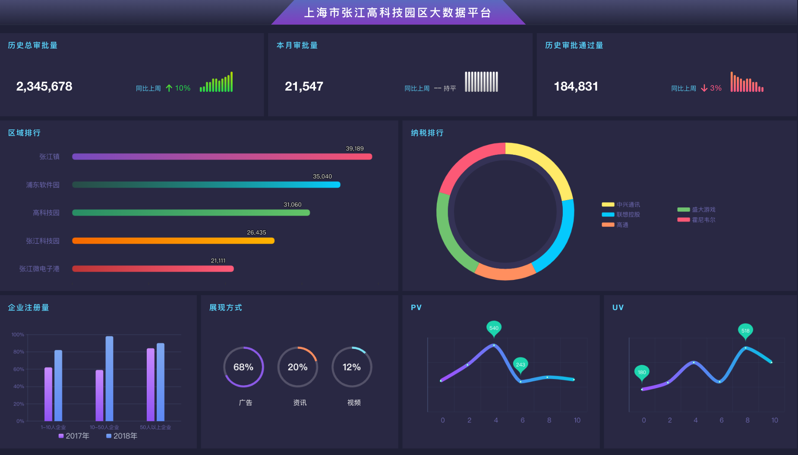
## 大屏样例二
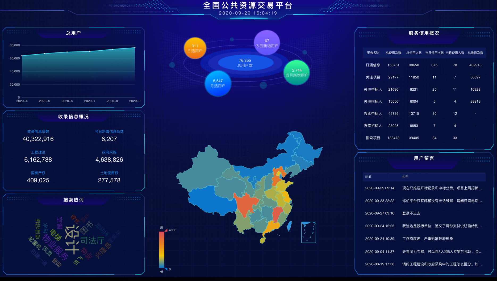
## 大屏样例三
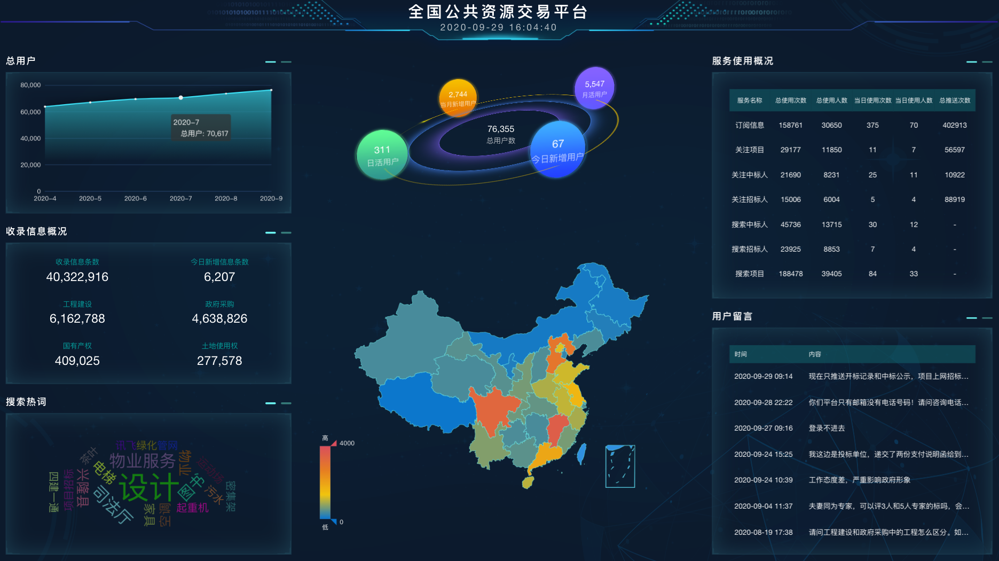

#### 折线图
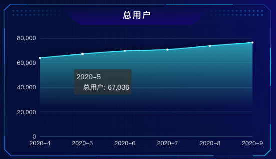

#### 数据展示
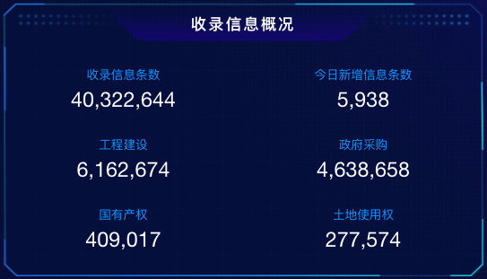

#### 词云图
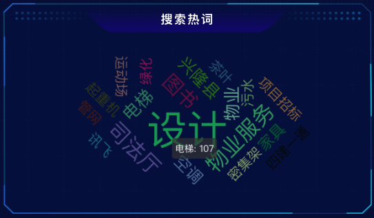

#### 数据统计
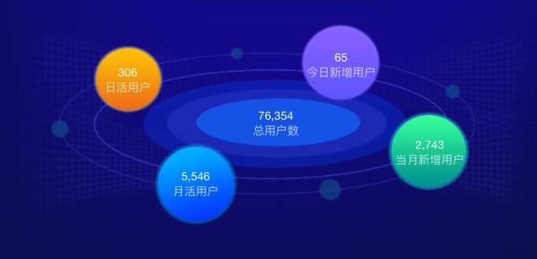

#### 地图
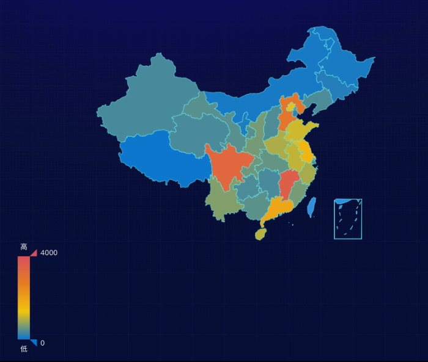

#### 表格
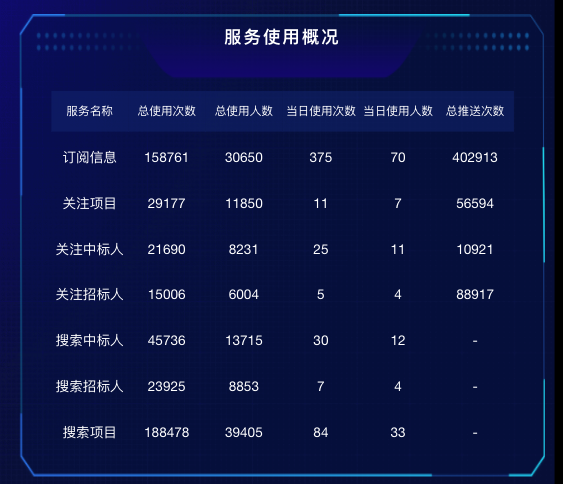

#### 表格数据（数据滚动）
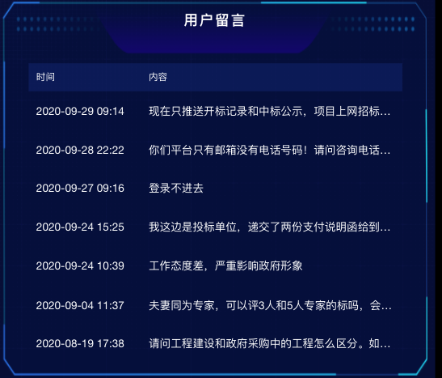

#### 数据展示

#### 柱状图（横向渐变）
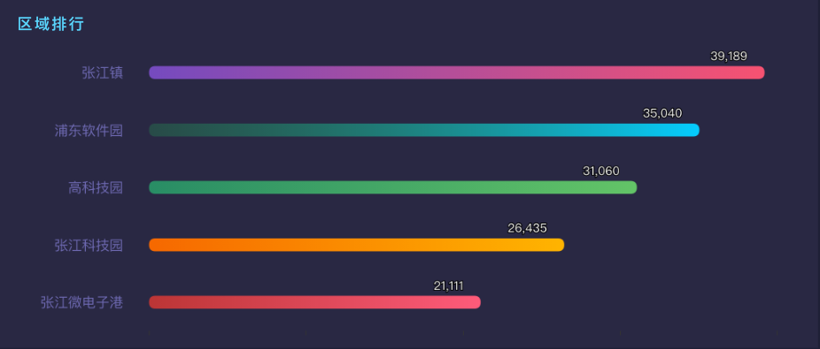

#### 柱状图（多列柱状图）
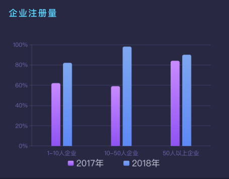

#### 饼图（双列圆环）
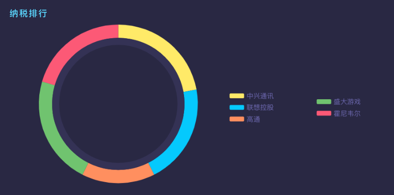

#### 饼图（多个环）
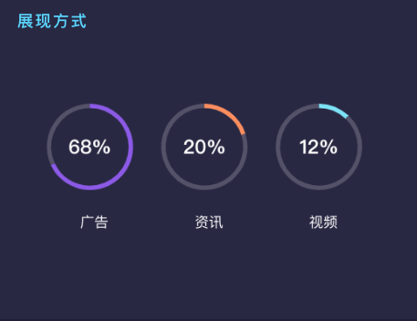

#### 折线图
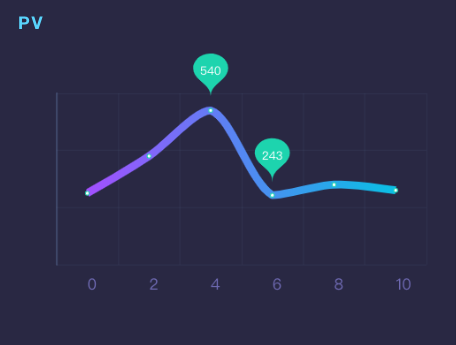
