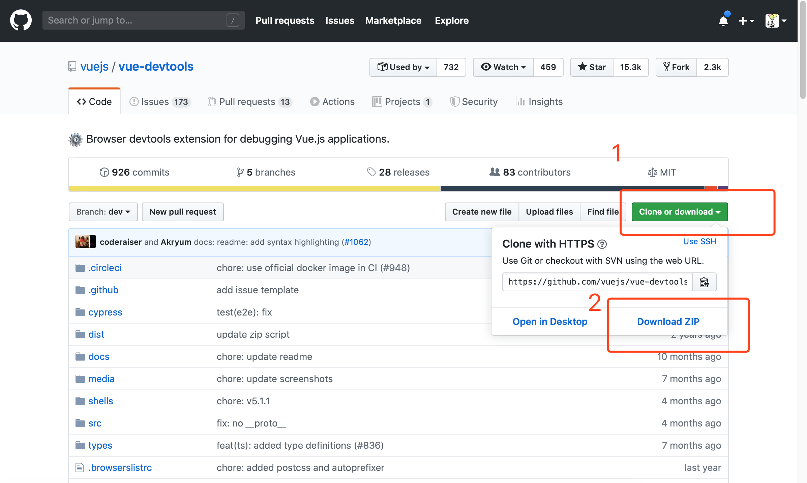

# 安装

## Chrome调试工具 - vue Devtool

Vue.js devtools是基于google chrome浏览器的一款调试vue.js应用的开发者浏览器扩展，可以在浏览器开发者工具下调试代码。如下图所示：


## 下载源码
首先在github下载devtools源码，地址：`https://github.com/vuejs/vue-devtools`



下载好后使用编辑器打开`vue-devtools-master`工程 执行`npm install`, 下载依赖，然后执行`npm run build`，编译源程序。 目录如下图所示：


## 编辑内容
修改`shells / chrome`目录下的`mainifest.json` 中的 `'persistent'` 为`true`：

```json
...
"background": {
    "scripts": [
      "build/background.js"
    ],
    "persistent": true
  },
...
```

如图所示：


又设置谷歌浏览器
打开谷歌浏览器的`设置 -> 扩展程序`，并勾选开发者模式：


##  


然后将刚刚编译后的工程中的`shells`目录下，`chrome`的整个文件夹直接拖拽到当前浏览器中，并选择启用，即可将插件安装到浏览器。


## 判断扩展工具是否安装成功

点击开发者工具，显示 `Vue.js is detected on this page. Open DevTools and look for the Vue panel.`，如下图所示；


## 工具无效

方法一：将vue项目重启；
方法二：将开发者工具重新打开；
方法三：清除浏览器缓存，重启浏览器；


